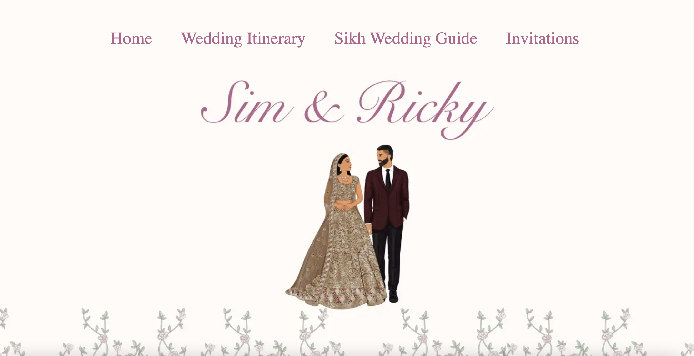
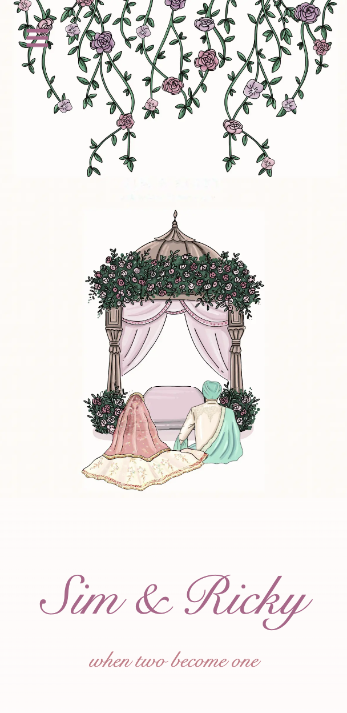

# 
# Wedding Website
<table>
<tr>
<td>
The wedding website serves as a digital platform to share important details and updates with guests regarding the wedding celebration.
</td>
</tr>
</table>

## Live
Here is a link to the live site :  https://simandricky.com

## Site

### Landing Page
Currently it is working on Asia Pacific (Sydney) Region.

## Mobile support
The website is compatible with devices of all sizes and all OS's, and consistent improvements are being made.

## Built with

- [TypeScript](https://www.typescriptlang.org/) - TypeScript allows us to declare types for variables, functions, parameters, and return values, helping us catch type-related errors during development, offering an additional layer of safety and predictability.
- [Tailwind](https://tailwindcss.com/) - Tailwind is a CSS framework that streamlines the process of styling and designing web interfaces.
- [Next.js](https://nextjs.org/) - Next.js is used to simplify serverside redendering and allows us to create API endpoints within the project. 
- [React](https://react.dev/) - React is used to create the UI interface and  UI components.

## To-do
- Create a transition for the title
- Create nav bar to include title on small media screens

## Team

Github - 
[Elisa Do](https://github.com/ED0920/wedding) 

